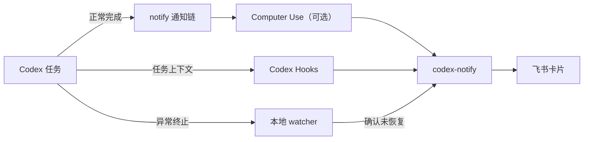

<div align="center">

<h1><br>codex-notify</h1>

**让 Codex 完成任务或意外中断时，及时在飞书提醒你。**

[](https://github.com/JunieXD/codex-notify/releases/latest)
[](https://github.com/JunieXD/codex-notify/actions/workflows/ci.yml)

[](LICENSE)

[快速开始](#快速开始) · [功能](#主要功能) · [常用命令](#常用命令) · [隐私安全](#隐私与安全) · [更新公告](https://github.com/JunieXD/codex-notify/releases)

</div>

`codex-notify` 是一个非官方、本地优先的 Codex 通知工具。你可以让 Codex 在后台安心工作，任务结束后直接从飞书查看结果；如果任务因网络、服务或用量限制而中断，也能及时收到提醒。

## 主要功能

- **完成提醒**：展示任务标题、耗时、原始任务和完整结果。
- **中断提醒**：识别网络断开、服务异常、用量限制等终止情况。
- **减少误报**：异常出现后会等待并确认任务没有自动恢复，再发送提醒。
- **登录自启**：安装低资源占用的后台 watcher，无需管理员权限。
- **兼容 Computer Use**：保持 Computer Use 在通知链最外层，避免重复执行。
- **适配多套配置**：切换 `config.toml` 后自动补回集成，并保留各自原有 notifier。
- **安全存储**：App Secret 仅保存在系统钥匙串或凭据管理器中。
- **随时撤销**：保留原有 Codex notifier，卸载时恢复原配置。

## 支持平台

| 平台 | 安装包 | 后台启动 |
| --- | --- | --- |
| macOS Apple Silicon | `aarch64-apple-darwin` | LaunchAgent |
| macOS Intel | `x86_64-apple-darwin` | LaunchAgent |
| Windows x64 | `x86_64-pc-windows-msvc` | 当前用户登录项 |
| Linux ARM64 | `aarch64-unknown-linux-gnu` | systemd 用户服务 |
| Linux x64 | `x86_64-unknown-linux-gnu` | systemd 用户服务 |

Linux 需要 systemd 用户会话和可用的 Secret Service，例如 Ubuntu 桌面自带的 GNOME Keyring。安装和运行均不需要管理员权限。

## 快速开始

### 1. 安装

macOS 与 Linux：

```sh
curl -fsSL https://raw.githubusercontent.com/JunieXD/codex-notify/main/scripts/install.sh | sh
```

Windows PowerShell：

```powershell
irm https://raw.githubusercontent.com/JunieXD/codex-notify/main/scripts/install.ps1 | iex
```

安装脚本会自动下载当前平台的最新发行包并校验 SHA-256。它只安装可执行文件，不会修改 Codex 或飞书配置。

### 2. 准备飞书应用

第一次配置通常需要 5～10 分钟。`codex-notify` 使用的是**企业自建应用机器人**：它只在你的飞书组织内使用，通过 App ID 和 App Secret 安全发送消息。它不是群聊中通过 Webhook 地址配置的“自定义机器人”，请不要选错类型。

飞书开放平台的界面名称可能会略有调整，找到含有下面关键词的入口即可。

#### 2.1 先了解几个常见词

| 名称 | 简单解释 |
| --- | --- |
| 企业自建应用 | 由你的飞书组织自己创建和管理的应用，不会公开上架到应用商店 |
| 机器人能力 | 让应用可以用“机器人”的身份向个人或群聊发送消息 |
| 权限 | 明确允许应用调用哪些飞书接口；本项目只需要发送消息相关权限 |
| App ID | 应用的公开编号，用来识别是哪一个应用，通常以 `cli_` 开头 |
| App Secret | 应用密钥，相当于这个应用的密码，不能公开或提交到 Git 仓库 |
| 接收者 ID | 告诉飞书把通知发给谁，可以使用邮箱、用户 ID 或群聊 ID |

#### 2.2 创建企业自建应用

1. 打开[飞书开放平台](https://open.feishu.cn/app)，使用接收通知的飞书组织账号登录。
2. 进入“开发者后台”，点击“创建企业自建应用”。
3. 填写应用名称，例如 `Codex Notify`；图标和描述可以按需填写。
4. 创建完成后进入应用详情页。后续的机器人、权限、凭证和发布设置都在这里完成。

如果看不到创建按钮，通常是当前账号没有创建应用的权限，请联系飞书组织管理员开通。应用和通知接收者需要属于同一个飞书组织。

#### 2.3 添加机器人能力

1. 在应用详情页找到“添加应用能力”或“应用能力”。
2. 选择“机器人”，然后点击“添加”或“启用”。
3. 机器人名称可以直接使用应用名称，其他展示信息按需填写。

这里的“机器人”是应用发送消息时使用的飞书身份。`codex-notify` 只负责调用它发送通知，不会读取你的飞书聊天记录。

#### 2.4 开通发送消息权限

1. 打开“权限管理”或“API 权限”。
2. 搜索“以应用的身份发消息”，添加对应权限；权限标识通常是 `im:message:send_as_bot`。
3. 如果后台显示“获取与发送单聊、群组消息”，也可以开通这项消息权限。
4. 确认权限状态已经生效。部分飞书组织需要管理员审批，处于“待审核”状态时还不能发送通知。

只发送通知不需要开通读取聊天内容的权限。建议遵循最小权限原则，不要添加与发送消息无关的权限。

#### 2.5 发布应用并设置可用范围

1. 进入“版本管理与发布”，点击“创建版本”。
2. 填写版本号和更新说明，例如版本号 `1.0.0`、更新说明“用于接收 Codex 通知”。
3. 在发布页面或飞书管理后台设置“可用范围”，确保通知接收者包含在范围内。
4. 提交审核并发布。管理员审核通过后，状态应显示为已发布或已启用。

“发布”是让刚才配置的机器人和权限正式生效。仅保存开发配置还不够，未发布的应用通常无法向用户发送消息。

#### 2.6 获取 App ID 和 App Secret

1. 打开“凭证与基础信息”。
2. 复制 App ID，它通常以 `cli_` 开头。
3. 点击查看并复制 App Secret。请像保管密码一样保管它，不要发到聊天、截图或写入公开文件。

初始化时 App Secret 的输入内容会隐藏。`codex-notify` 会将它保存到 macOS 钥匙串、Windows 凭据管理器或 Linux Secret Service，不会明文写入配置文件。

#### 2.7 选择通知接收者

第一次使用建议选择**邮箱**：填写接收人的飞书账号邮箱即可，不需要了解飞书内部 ID。

| 接收方式 | 需要填写的内容 | 适用场景 |
| --- | --- | --- |
| 邮箱 `email` | 接收人飞书账号绑定的邮箱，例如 `name@example.com` | 最容易上手，推荐首次使用 |
| Open ID `open_id` | 当前应用下形如 `ou_xxx` 的用户 ID | 私聊通知；不同应用中的 Open ID 可能不同 |
| User ID `user_id` | 飞书组织为成员设置的内部用户 ID | 已从通讯录管理员或接口获得 User ID |
| 群聊 ID `chat_id` | 形如 `oc_xxx` 的会话 ID | 将通知发到群聊，机器人必须已经加入该群 |

邮箱必须是飞书能够识别的账号邮箱，并且该用户位于应用的可用范围内。如果不确定 Open ID、User ID 或 Chat ID 在哪里获取，直接使用邮箱即可。

运行初始化前，请确认你已经准备好：

- 一个已发布并启用机器人能力的企业自建应用；
- 已生效的发送消息权限；
- 同一个应用的 App ID 和 App Secret；
- 位于应用可用范围内的接收者邮箱，或其他类型的接收者 ID。

### 3. 初始化

```sh
codex-notify init
```

中文向导会说明每项信息的获取位置。App Secret 输入时不会显示内容，接收方式可用方向键选择；填错时可以直接重新输入，无需重新运行命令。确认前不会修改任何文件，确认后会先备份现有配置。

如果已经配置过，再次运行 `init` 会先显示当前配置并默认保留退出。只有明确选择“重新配置”后，才会替换飞书设置和 App Secret；原有 Codex 通知命令与其他 Hook 会继续保留，相关配置也会提前备份。

初始化完成后还需要信任新增的 `UserPromptSubmit` 和 `Stop` Hook：

- ChatGPT App（原 Codex App）：打开“设置”，进入“钩子”，在“用户”区域将这两个 Hook 分别设为“信任”。
- Codex CLI：运行 `/hooks`，然后信任这两个 Hook。

### 4. 检查是否可用

```sh
codex-notify test
codex-notify doctor
```

收到测试卡片且 `doctor` 没有报错，就可以正常使用了。

命令帮助、状态、检查、升级和卸载提示均使用中文；添加 `--json` 时会保留稳定的英文键名，方便脚本读取。

## 常用命令

| 命令 | 用途 |
| --- | --- |
| `codex-notify init` | 配置飞书并接入 Codex |
| `codex-notify test` | 发送一条测试通知 |
| `codex-notify status` | 查看安装和配置状态 |
| `codex-notify doctor` | 检查常见配置问题 |
| `codex-notify sync` | 立即同步当前 `config.toml` 的通知链 |
| `codex-notify update` | 安全升级到最新版本 |
| `codex-notify watch --once` | 手动扫描一次中断事件 |
| `codex-notify uninstall` | 移除集成并恢复原配置 |

`status` 和 `doctor` 均支持 `--json`，便于脚本读取。

## 工作方式



后台 watcher 只增量读取最近变动的本地会话记录，并保存读取位置，不会反复扫描完整历史。

## 中断提醒的边界

中断检测依赖 Codex 写入本地会话记录，因此属于尽力而为。断电、系统崩溃或强制结束进程时，如果 Codex 还没来得及写入终止信息，就无法发送提醒。

## 与现有 notifier 共存

初始化会保留并继续调用已有的 Codex `notify` 命令。检测到 Computer Use 时，CLI 会保持它在最外层，再把 `codex-notify` 接入其 `--previous-notify`；`codex-notify` 不会反向调用 Computer Use，因此不会形成重复链。

如果旧 notifier 也向飞书发送消息，仍可能收到两条飞书提醒。确认 `codex-notify` 工作正常后，再停用旧工具的飞书发送功能。

## 多套 Codex 配置

如果你使用配置管理工具切换同一 `CODEX_HOME` 下的 `config.toml`，后台 watcher 会检测当前配置并自动补回通知链。每套配置原有的 notifier 会保存在它自己的托管命令中，不会与其他配置混用。

安装时会记住当前应用目录和 `CODEX_HOME`，重新登录系统后仍会监控同一套配置。

需要立即同步时运行：

```sh
codex-notify sync
```

CLI 支持配置文件符号链接，写入时会保留链接本身。无法识别或损坏的 Computer Use 包装不会被覆盖，`doctor` 会提示人工检查。

## 升级与卸载

日常升级直接运行：

```sh
codex-notify update
```

只想检查新版本：

```sh
codex-notify update --check
```

也可以重新运行[快速开始](#1-安装)中的 curl 或 PowerShell 安装命令。脚本会识别已有安装，并调用同一套安全升级流程。

升级会先下载并校验 SHA-256，再停止后台 watcher、替换程序、刷新现有集成并重新启动。飞书密钥、通知链和已记录的多套 Codex 配置都会保留；升级失败时会自动恢复旧程序和后台服务。

需要安装指定版本时，可运行 `codex-notify update --version vX.Y.Z`。默认不会降级；只有明确加上 `--force` 才允许安装旧版本。

卸载：

```sh
codex-notify uninstall
```

卸载只移除 `codex-notify` 管理的 Hook、后台启动项、凭据和状态，并恢复已记录配置文件原有的 notifier。Computer Use 会继续保留在通知链最外层。

## 隐私与安全

- 没有云端中转服务、遥测或行为分析。
- App Secret 不会写入配置文件或日志。
- 任务内容和结果只发送给你配置的飞书接收者。
- 修改 Codex 配置前会在本地创建带时间戳的备份。

## 开发与发布

```sh
cargo fmt --check
cargo clippy --all-targets -- -D warnings
cargo test --all-targets
```

架构细节见 [项目规格](docs/specification.md)，维护者发布流程见 [发布指南](docs/releasing.md)。

## 许可证

[MIT](LICENSE) © JunieXD
