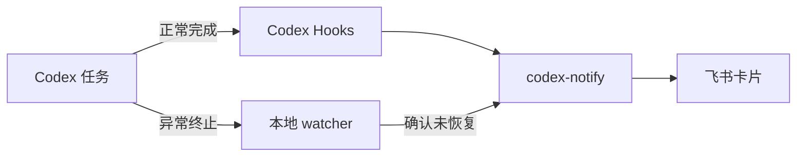

<div align="center">


<h1>codex-notify</h1>

**让 Codex 完成任务或意外中断时，及时在飞书提醒你。**

[](https://github.com/JunieXD/codex-notify/releases/latest)
[](https://github.com/JunieXD/codex-notify/actions/workflows/ci.yml)

[](LICENSE)

[快速开始](#快速开始) · [功能](#主要功能) · [常用命令](#常用命令) · [隐私安全](#隐私与安全) · [更新公告](https://github.com/JunieXD/codex-notify/releases)

</div>

`codex-notify` 是一个非官方、本地优先的 Codex 通知工具。你可以让 Codex 在后台安心工作，任务结束后直接从飞书查看结果；如果任务因网络、服务或用量限制而中断，也能及时收到提醒。

## 主要功能

- **完成提醒**：展示任务标题、耗时、原始任务和完整结果。
- **中断提醒**：识别网络断开、服务异常、用量限制等终止情况。
- **减少误报**：异常出现后会等待并确认任务没有自动恢复，再发送提醒。
- **登录自启**：安装低资源占用的后台 watcher，无需管理员权限。
- **安全存储**：App Secret 仅保存在 macOS 钥匙串或 Windows 凭据管理器中。
- **随时撤销**：保留原有 Codex notifier，卸载时恢复原配置。

## 支持平台

| 平台 | 安装包 | 后台启动 |
| --- | --- | --- |
| macOS Apple Silicon | `aarch64-apple-darwin` | LaunchAgent |
| macOS Intel | `x86_64-apple-darwin` | LaunchAgent |
| Windows x64 | `x86_64-pc-windows-msvc` | 当前用户登录项 |

Linux 暂未提供发行包。

## 快速开始

### 1. 安装

macOS：

```sh
curl -fsSL https://raw.githubusercontent.com/JunieXD/codex-notify/main/scripts/install.sh | sh
```

Windows PowerShell：

```powershell
irm https://raw.githubusercontent.com/JunieXD/codex-notify/main/scripts/install.ps1 | iex
```

安装脚本会自动下载当前平台的最新发行包并校验 SHA-256。它只安装可执行文件，不会修改 Codex 或飞书配置。

### 2. 准备飞书应用

1. 创建一个飞书企业自建应用。
2. 开通机器人能力和发送消息权限，然后发布应用。
3. 与机器人建立私聊，准备好 App ID、App Secret 和接收者 ID。

支持 `open_id`、`user_id`、邮箱和群聊 `chat_id`。私聊场景建议使用 `open_id`。

### 3. 初始化

```sh
codex-notify init
```

根据提示填写飞书信息并确认修改。初始化完成后，在 Codex 中运行 `/hooks`，信任新增的 `UserPromptSubmit` 和 `Stop` Hook。

### 4. 检查是否可用

```sh
codex-notify test
codex-notify doctor
```

收到测试卡片且 `doctor` 没有报错，就可以正常使用了。

## 常用命令

| 命令 | 用途 |
| --- | --- |
| `codex-notify init` | 配置飞书并接入 Codex |
| `codex-notify test` | 发送一条测试通知 |
| `codex-notify status` | 查看安装和配置状态 |
| `codex-notify doctor` | 检查常见配置问题 |
| `codex-notify watch --once` | 手动扫描一次中断事件 |
| `codex-notify uninstall` | 移除集成并恢复原配置 |

`status` 和 `doctor` 均支持 `--json`，便于脚本读取。

## 工作方式



后台 watcher 只增量读取最近变动的本地会话记录，并保存读取位置，不会反复扫描完整历史。

## 中断提醒的边界

中断检测依赖 Codex 写入本地会话记录，因此属于尽力而为。断电、系统崩溃或强制结束进程时，如果 Codex 还没来得及写入终止信息，就无法发送提醒。

## 与现有 notifier 共存

初始化不会直接覆盖已有的 Codex `notify` 命令，而是先保存并继续调用它。如果旧 notifier 也向飞书发送消息，可能出现重复提醒；确认 `codex-notify` 工作正常后，再停用旧工具的飞书发送功能。

## 升级与卸载

升级时重新运行对应平台的安装命令即可。

```sh
codex-notify uninstall
```

卸载只移除 `codex-notify` 管理的 Hook、后台启动项、凭据和状态，并恢复安装前保存的 notifier。

## 隐私与安全

- 没有云端中转服务、遥测或行为分析。
- App Secret 不会写入配置文件或日志。
- 任务内容和结果只发送给你配置的飞书接收者。
- 修改 Codex 配置前会在本地创建带时间戳的备份。

## 开发与发布

```sh
cargo fmt --check
cargo clippy --all-targets -- -D warnings
cargo test --all-targets
```

架构细节见 [项目规格](docs/specification.md)，维护者发布流程见 [发布指南](docs/releasing.md)。

## 许可证

[MIT](LICENSE) © JunieXD
