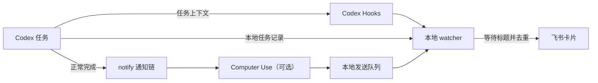

# 工作原理

`codex-notify` 完全运行在用户电脑上，由完成通知链、Codex Hook 和后台 watcher 三部分协作。正常完成事件先写入本地队列，再由 watcher 统一发送。

## 正常完成流程

1. Codex 完成一轮任务并触发用户级 `notify`；
2. Computer Use 如已启用，会先处理自己的事件；
3. `codex-notify` 将完成事件持久化到本地队列并立即返回，不阻塞 Codex 生成会话标题；
4. 原有 notifier 如存在，会继续收到同一事件；
5. watcher 读取 Hook 保存的任务上下文，等待标题生成，最长 5 秒；
6. watcher 生成飞书卡片并直接调用飞书开放平台，发送失败会保留事件稍后重试。

如果任务在安装或升级前已经打开，可能不会调用新配置的 `notify`。watcher 还会增量识别本地任务记录中的正常完成事件，补充这类旧任务；同一个 turn 无论从哪条路径到达，都只会进入一次发送流程。

## 中断确认流程

1. watcher 增量读取最近变化的 Codex 本地任务记录；
2. `Stop` Hook 在缺少最终消息时提供一个候选事件；
3. 发现网络、服务、用量限制或没有最终完成消息的 `turn_aborted` 后，先保存为待确认状态；
4. 等待后再次确认任务没有恢复，也没有正常完成事件；
5. 发送中断卡片，并用事件标识避免重复通知。

watcher 会保存读取位置，不会每次扫描完整会话历史。

## 为什么需要三个入口

- `notify` 是正常完成的官方直接信号；
- `UserPromptSubmit` Hook 补充任务内容和开始时间；
- watcher 补获旧任务的完成记录，并与 `Stop` Hook 一起确认异常情况。

只依赖其中一个入口，都无法同时获得完整任务信息、可靠完成通知和中断提醒。

## 本地优先的数据流

项目没有中转服务器、共享数据库或遥测服务。任务信息从本机 Codex 会话进入 `codex-notify`，然后直接发送到你配置的飞书接收者。

更完整的实现约束见[项目规格](/specification)，隐私边界见[隐私与安全](/reference/security)。
